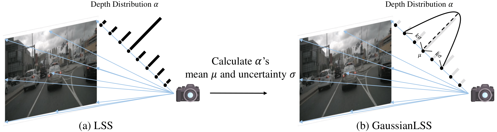

# <div align="center">**GaussianLSS - Toward Real-world BEV Perception: Depth Uncertainty Estimation via Gaussian Splatting**</div>
<div align="center"></div>
This is the official repository of CVPR'25 paper: GaussianLSS - Toward Real-world BEV Perception: Depth Uncertainty Estimation via Gaussian Splatting.

# ⚙️ Installation
Create the environment with conda:
```bash
# Clone repo first
git clone https://github.com/HCIS-Lab/GaussianLSS

# Create python 3.8
conda create -y --name GaussianLSS python=3.8.0
conda activate GaussianLSS

# Install pytorch 2.1.0
pip install torch==2.1.0 torchvision==0.16.0 torchaudio==2.1.0 --index-url https://download.pytorch.org/whl/cu121

# Install other dependencies
pip install -r requirements.txt

# Install Gaussian Splatting
# Check if your cudatoolkit's version is same as pytorch build.
cd GaussianLSS/model/diff-gaussian-rasterization
pip install -e .
```
# 📦 Dataset preparation
## 📁 nuScenes Dataset
Go to [nuScenes](https://www.nuscenes.org/nuscenes) and download & unzip the following data:
- Trainval
- Map expansion

After unzipping, create a link file:
```bash
mkdir data
ln -s {YOUR_NUSC_DATA_PATH} ./data/nuscenes
```

## 🏷️ Generate lable
Generate required labels for running via:
```bash
python scripts/generate_data.py
```
This packs 3D bounding boxes into individual files with ego poses. It would take within 10 minutes.

# 🚀 Training
To train GaussianLSS with vehicle class only:
```bash
python scripts/train.py +experiment=GaussianLSS
```
Or pedestrian class:
```bash
python scripts/train.py +experiment=GaussianLSS data=nuscenes_ped
```
And also map classes:
```bash
python scripts/train.py +experiment=GaussianLSS_map
```
Training an epoch would take about 15 minutes with 2 RTX4090 gpus.
# ✅ Evaluation
Evaluate trained model with:
```bash
python scripts/evaluate.py +experiment={EXP_NAME} +ckpt={CHECKPOINT_PATH}
```

# 🖼️ Visualization
Run visualize.ipynb to create a gif visualization like this:
<div align="center">

</div>

# TODO
- [ ] Add checkpoints.

# 🙏 Acknowledgements
This implementation is mainly based on:
- https://github.com/bradyz/cross_view_transformers
- https://github.com/valeoai/PointBeV

And Gaussian Splatting:
- https://github.com/graphdeco-inria/gaussian-splatting

Thanks to these great open-source implementations!

# 📚 Bibtex
If you find this work helpful, please consider citing our paper:
```bash
@inproceedings{lu2025GaussianLSS,
        author    = {Shu-Wei Lu and Yi-Hsuan Tsai and Yi-Ting Chen},
        title     = {Toward Real-world BEV Perception: Depth Uncertainty Estimation via Gaussian Splatting},
        booktitle = {Proceedings of the IEEE/CVF Conference on Computer Vision and Pattern Recognition (CVPR)},
        year      = {2025}
}
```